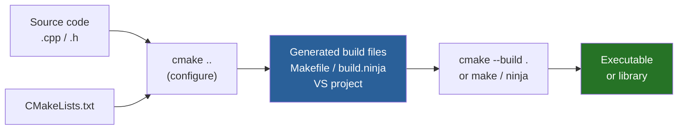
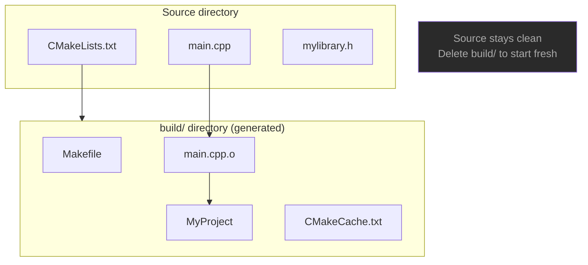
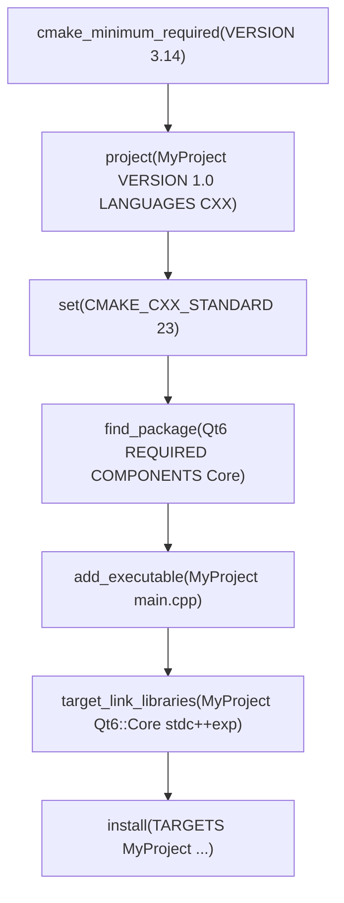
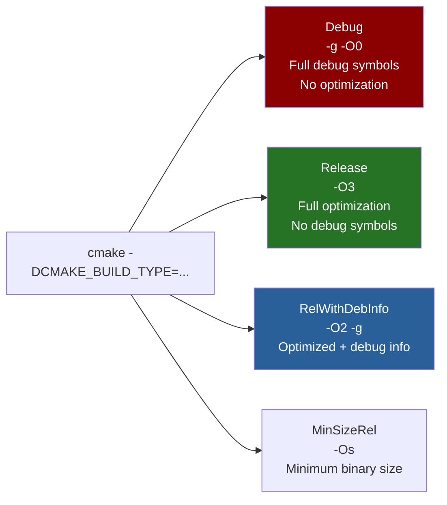
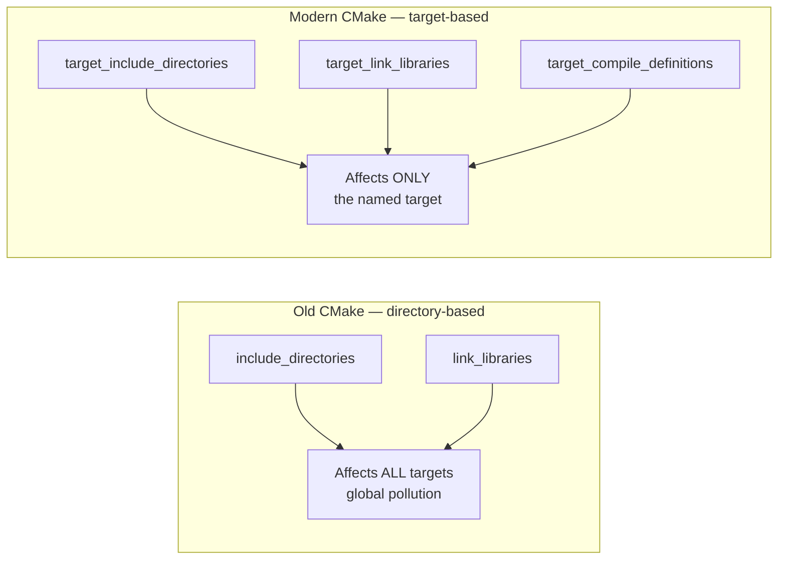
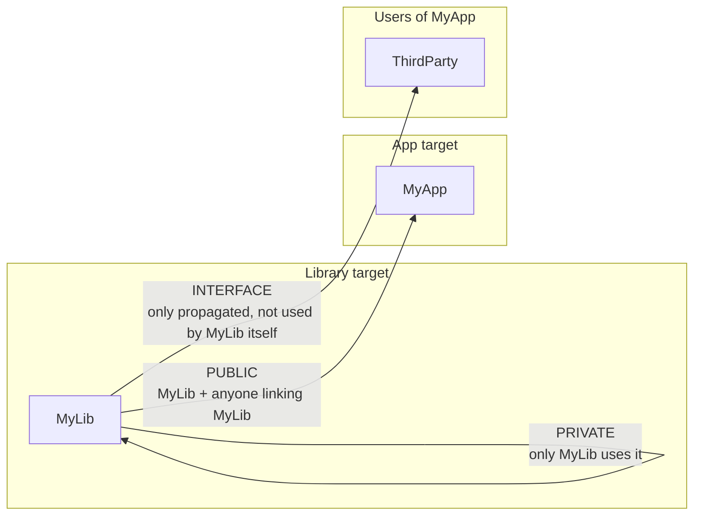
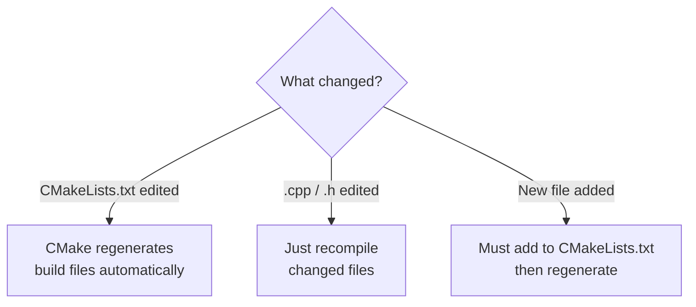

# CMake — Build System

## What is CMake?

CMake is a **cross-platform build system generator**. It does not compile
your code directly — it generates the build files (Makefiles, Ninja files,
Visual Studio projects) that then do the actual compilation.

---

## CMake workflow



---

## Out-of-source build



```bash
mkdir build && cd build
cmake ..        # configure — reads CMakeLists.txt, generates Makefiles
cmake --build . # compile
```

---

## CMakeLists.txt structure



---

## Key CMake commands

### project()

```cmake
project(MyProject
    VERSION     1.0.0
    DESCRIPTION "My C++ project"
    LANGUAGES   CXX
)
# Sets: PROJECT_NAME, PROJECT_VERSION, PROJECT_VERSION_MAJOR/MINOR/PATCH
```

### add_executable / add_library

```cmake
add_executable(MyApp main.cpp utils.cpp)      # builds an executable
add_library(MyLib STATIC mylibrary.cpp)        # builds libMyLib.a
add_library(MyLib SHARED mylibrary.cpp)        # builds libMyLib.so
add_library(MyLib INTERFACE)                   # header-only library
```

### target_link_libraries

```cmake
target_link_libraries(MyApp
    PRIVATE MyLib        # MyLib used by MyApp only
    PUBLIC  Qt6::Core    # Qt6::Core also exposed to users of MyApp
)
```

### find_package

```cmake
find_package(Qt6 REQUIRED COMPONENTS Core Widgets)
find_package(benchmark REQUIRED)
find_package(OpenSSL REQUIRED)

# After find_package — use imported targets
target_link_libraries(MyApp Qt6::Core Qt6::Widgets)
```

### Variables and options

```cmake
set(MY_VAR "hello")                     # set a variable
option(ENABLE_TESTS "Build tests" ON)   # user-configurable ON/OFF

# Use with cmake -DENABLE_TESTS=OFF ..
if(ENABLE_TESTS)
    add_subdirectory(tests)
endif()
```

### message() — print during configuration

```cmake
message(STATUS "Build type: ${CMAKE_BUILD_TYPE}")
message(WARNING "OpenSSL not found — disabling TLS")
message(FATAL_ERROR "Qt6 is required")
```

---

## Build types



```bash
cmake -DCMAKE_BUILD_TYPE=Release ..
cmake -DCMAKE_BUILD_TYPE=Debug ..
```

In Qt Creator: **Projects → Build → Build Configuration → Release/Debug**

---

## Modern CMake — target-based approach



```cmake
# OLD — avoid this
include_directories(include/)
link_libraries(mylib)

# MODERN — always do this
target_include_directories(MyApp PRIVATE include/)
target_link_libraries(MyApp PRIVATE mylib)
target_compile_definitions(MyApp PRIVATE DEBUG_MODE)
```

---

## PRIVATE / PUBLIC / INTERFACE



---

## Useful CMake variables

| Variable | Value |
|----------|-------|
| `CMAKE_BUILD_TYPE` | Debug / Release / RelWithDebInfo |
| `CMAKE_CXX_STANDARD` | 11 / 14 / 17 / 20 / 23 |
| `CMAKE_CXX_COMPILER` | Path to compiler |
| `CMAKE_INSTALL_PREFIX` | Installation root (default `/usr/local`) |
| `PROJECT_NAME` | Set by `project()` |
| `PROJECT_VERSION` | Set by `project(VERSION ...)` |
| `CMAKE_CURRENT_SOURCE_DIR` | Current CMakeLists.txt directory |
| `CMAKE_BINARY_DIR` | Build directory |

---

## Common terminal workflow

```bash
# Configure (create build directory)
cmake -B build -DCMAKE_BUILD_TYPE=Release

# Build
cmake --build build

# Build with parallel jobs (faster)
cmake --build build -j$(nproc)

# Install
cmake --install build

# Clean
cmake --build build --target clean

# List all targets
cmake --build build --target help
```

---

## When does CMake regenerate?



In Qt Creator — after editing `CMakeLists.txt`:
**Build → Clear CMake Configuration → Run CMake**

---

## When to use CMake

✅ Any C++ project with more than one source file
✅ Cross-platform builds (Linux / Windows / macOS)
✅ Managing dependencies (`find_package`)
✅ Qt projects — Qt Creator generates CMakeLists.txt automatically
✅ CI/CD pipelines — deterministic build configuration

❌ Single-file programs → `g++ main.cpp -o app` is enough
