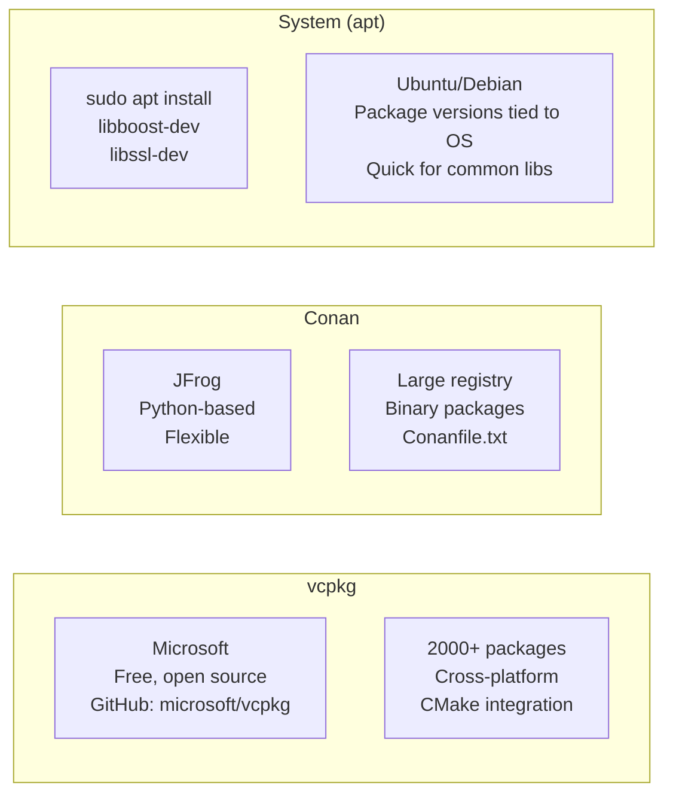
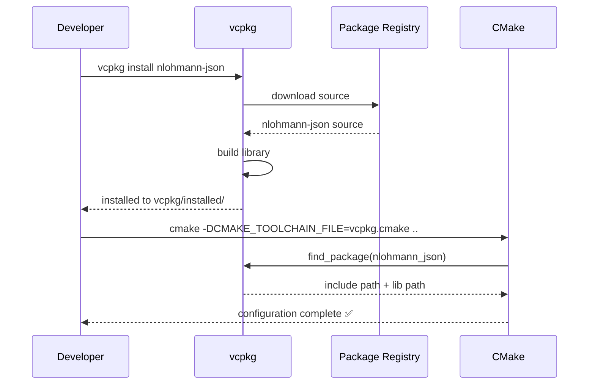
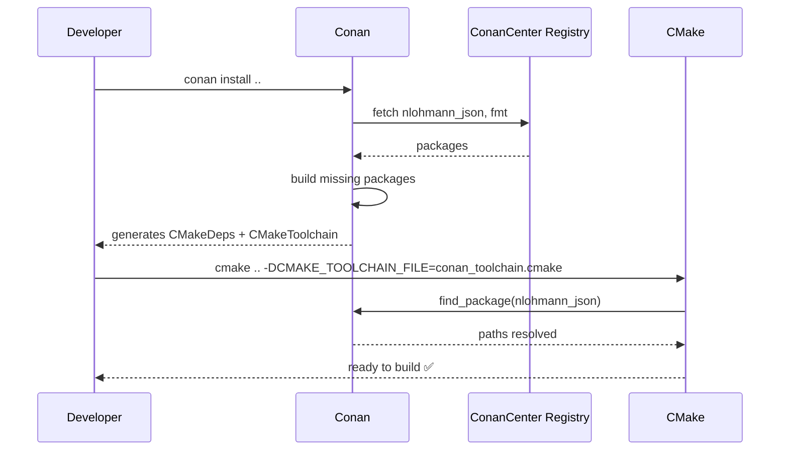
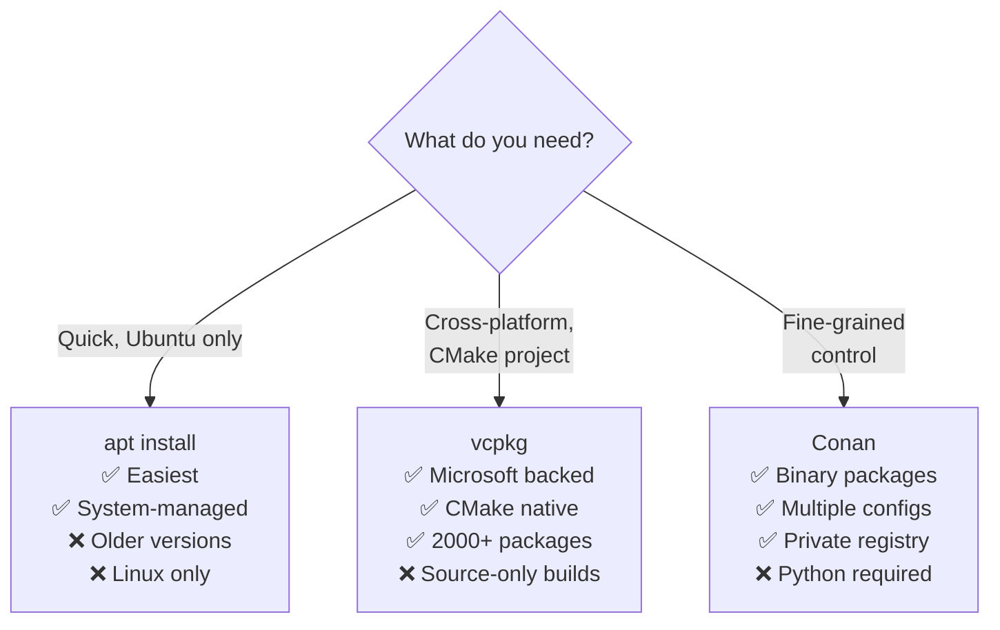

# Package Managers — C++

## What is a Package Manager?

A package manager automates **downloading, building, and linking**
third-party libraries into your C++ project. Without one, you would
manually download source, compile it, and configure include/lib paths.

---

## The C++ dependency problem

```mermaid
flowchart TD
    subgraph Without ["Without package manager"]
        A[Find library online] --> B[Download source / binary]
        B --> C[Build it yourself]
        C --> D[Copy to project]
        D --> E[Configure include paths]
        E --> F[Configure lib paths]
        F --> G[Hope it links correctly]
        G --> H["😩 repeat for every library\nand every version"]
    end

    subgraph With ["With package manager"]
        I["vcpkg install nlohmann-json\nor: conan install ."] --> J[Done ✅]
        J --> K[CMake finds it automatically\nwith find_package()]
    end
```

---

## Popular C++ package managers



---

## vcpkg — setup and usage

### Install vcpkg

```bash
# Clone vcpkg
git clone https://github.com/microsoft/vcpkg.git
cd vcpkg
./bootstrap-vcpkg.sh   # Linux/macOS
# or: .\bootstrap-vcpkg.bat  (Windows)
```

### Install packages

```bash
vcpkg install nlohmann-json
vcpkg install fmt
vcpkg install spdlog
vcpkg install gtest
vcpkg install boost-system
```

### Integrate with CMake

```bash
cmake -DCMAKE_TOOLCHAIN_FILE=/path/to/vcpkg/scripts/buildsystems/vcpkg.cmake ..
```

Or set it in `CMakeLists.txt`:
```cmake
if(DEFINED ENV{VCPKG_ROOT})
    set(CMAKE_TOOLCHAIN_FILE
        "$ENV{VCPKG_ROOT}/scripts/buildsystems/vcpkg.cmake")
endif()
```

### Use in CMakeLists.txt

```cmake
find_package(nlohmann_json CONFIG REQUIRED)
find_package(fmt            CONFIG REQUIRED)
find_package(spdlog         CONFIG REQUIRED)

target_link_libraries(MyApp
    nlohmann_json::nlohmann_json
    fmt::fmt
    spdlog::spdlog
)
```

---

## vcpkg workflow diagram



---

## Conan — setup and usage

### Install Conan

```bash
pip install conan
conan profile detect   # auto-detect system profile
```

### conanfile.txt

```ini
[requires]
nlohmann_json/3.11.2
fmt/10.1.1
spdlog/1.12.0
boost/1.83.0

[generators]
CMakeDeps
CMakeToolchain
```

### Install packages

```bash
mkdir build && cd build
conan install .. --output-folder=. --build=missing
```

### Use in CMakeLists.txt

```cmake
find_package(nlohmann_json REQUIRED)
find_package(fmt REQUIRED)

target_link_libraries(MyApp
    nlohmann_json::nlohmann_json
    fmt::fmt
)
```

---

## Conan workflow diagram



---

## Popular packages — what they do

| Package | vcpkg name | What it provides |
|---------|-----------|-----------------|
| nlohmann/json | `nlohmann-json` | JSON parsing/serialization |
| fmtlib | `fmt` | Fast string formatting (std::format predecessor) |
| spdlog | `spdlog` | Fast logging library |
| Google Test | `gtest` | Unit testing framework |
| Boost | `boost` | Huge utility library collection |
| OpenSSL | `openssl` | TLS/SSL, cryptography |
| libcurl | `curl` | HTTP client |
| Catch2 | `catch2` | Unit testing (header-only) |
| Eigen | `eigen3` | Linear algebra / matrix math |
| protobuf | `protobuf` | Google Protocol Buffers |

---

## System packages (apt) — quick alternative

```bash
# For Ubuntu/Debian — no vcpkg needed for common libs
sudo apt install libboost-all-dev
sudo apt install libssl-dev
sudo apt install libcurl4-openssl-dev
sudo apt install libbenchmark-dev         # Google Benchmark
sudo apt install libgtest-dev             # Google Test
sudo apt install nlohmann-json3-dev       # nlohmann/json
sudo apt install libfmt-dev               # fmt
sudo apt install libspdlog-dev            # spdlog
```

Then in CMake:
```cmake
find_package(nlohmann_json REQUIRED)       # from apt
find_package(benchmark REQUIRED)           # from apt (libbenchmark-dev)
```

---

## vcpkg vs Conan vs apt



| | `apt` | `vcpkg` | `Conan` |
|--|:-----:|:-------:|:-------:|
| Platform | Linux only | Cross-platform | Cross-platform |
| Setup | None | Clone + bootstrap | pip install |
| Package count | ~80k total | ~2000 C++ | ~1700 C++ |
| Binary packages | ✅ | ❌ (source) | ✅ |
| CMake integration | Manual | Toolchain file | Toolchain file |
| Version control | OS decides | You decide | You decide |
| Best for | Quick dev, Ubuntu | CMake projects | Enterprise |

---

## Recommendation for this project (Ubuntu 24.04)

```bash
# Most packages available via apt — no setup needed
sudo apt install libbenchmark-dev    # already used in this repo!
sudo apt install nlohmann-json3-dev
sudo apt install libspdlog-dev
sudo apt install libgtest-dev
sudo apt install libfmt-dev

# For packages not in apt → use vcpkg
git clone https://github.com/microsoft/vcpkg
./vcpkg/bootstrap-vcpkg.sh
./vcpkg/vcpkg install <package-name>
```
